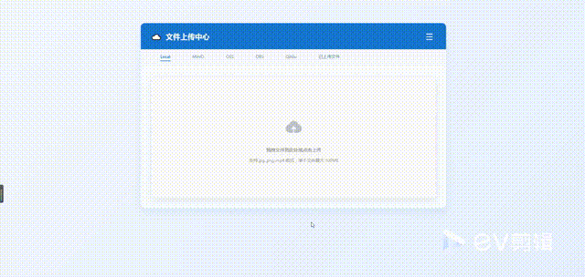
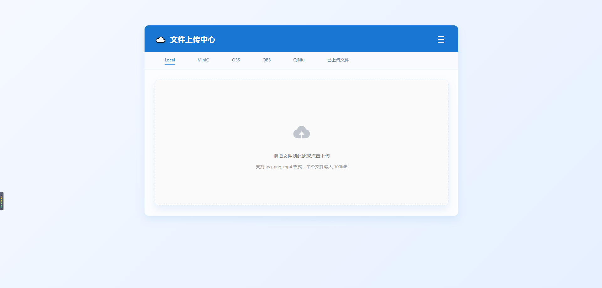
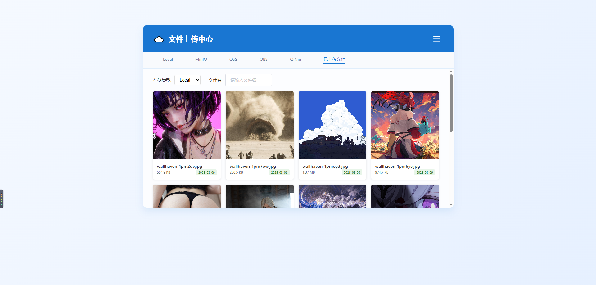
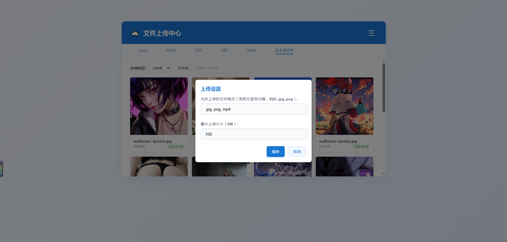
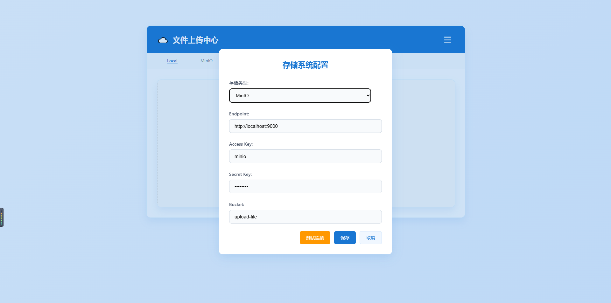
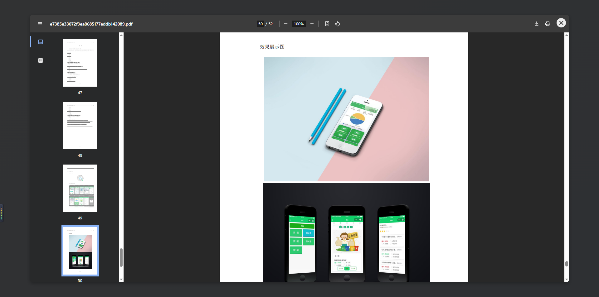
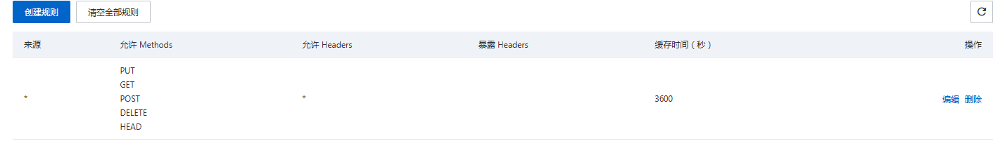

# upload-hub

一个支持多种存储方式的文件上传系统，提供简单易用的文件管理功能。

## 演示



## 项目简介

本项目是一个基于前后端分离架构的文件上传系统，支持多种存储方式，包括本地存储、阿里云 OSS 和 MinIO。用户可以通过直观的界面上传文件并管理已上传的文件。

### 技术栈
- **前端**:
    - Vue 2
    - ElementUI
- **后端**:
    - JDK 1.8
    - Spring Boot 2.3.12.RELEASE
    - MySQL 8.0.26
    - MyBatis-Plus
- **文件存储**:
    - Local（本地存储）
    - OSS（阿里云对象存储）
    - MinIO（分布式对象存储）
    - 敬请期待。。。

### 功能特性

- 断点续传
- 文件分片
- 文件校验
- 文件秒传
- 多文件上传
- 支持多种存储方式切换
- 文件预览（图片、视频、PDF）
- 存储配置连接测试


## 预览
### 首页


### 已上传文件 页面


### 上传设置


### 存储配置


### 文件预览

- 图片

    

- 视频

    

- PDF

    


## 快速开始

### 前端

1. 克隆项目到本地：
    ```bash
    git clone https://gitee.com/czh-dev/upload-hub.git
    cd upload-file-frontend
    ```

2. 安装依赖：
    ```bash
    npm install
    ```

3. 启动开发服务器：

    ```bash
    npm run serve
    ```
   
4. 访问应用： 在浏览器中打开 http://localhost:8080。


### 后端


1. 进入后端目录：

  ```bash
  cd upload-file-backend
  ```

2. 配置环境：

    确保已安装 JDK 1.8 和 Maven。
    在 application.yml 中配置数据库和存储服务参数（见下方配置说明）。

3. 构建并运行：

  ```bash
  mvn clean install
  mvn spring-boot:run
  ```

4. 接口地址： 默认运行在 http://localhost:10086。


## 目录结构

```text
.
├── upload-file-backend           # 后端代码
│   ├── src                       # 源代码
│   └── data                      # 本地上传的数据文件
│   └── sql                       # SQL 脚本
│   └── pom.xml                   # Maven 配置文件
├── upload-file-frontend          # 前端代码
│   ├── src                       # 源代码
│   ├── public                    # 静态资源
│   └── package.json              # NPM 配置文件
└── README.md                     # 项目说明文档
```


## 前期准备

### 数据库

1. 安装MySQL8.0或兼容版本

2. 创建数据库upload_file：

    ```sql
    CREATE DATABASE upload_file DEFAULT CHARACTER SET utf8mb4;
    ```

3. 执行 `sql` 目录下的 SQL 脚本初始化表结构。

### 本地存储

- 修改数据库配置（`storage_config`表）：

    **type=local**

    - Bucket：项目中data目录的绝对路径

### MinIO

> 可选


#### 创建MinIO容器

```bash
docker run -d --name upload-file \
  -p 9000:9000 \
  -p 9090:9090 \
  -e MINIO_ROOT_USER=minio \
  -e MINIO_ROOT_PASSWORD=minio123 \
  -v E:\develop\MinIO\data:/data \
  minio/minio server /data --console-address ":9090"
```

- 访问地址：http://localhost:9000（API） / http://localhost:9090（控制台） 

- 默认凭证：用户名 minio，密码 minio123 

- 存储路径：映射到本地 E:\develop\MinIO\data（Windows 示例，根据实际情况调整）。

- 创建Bucket，并且设置权限为`public`

- 修改数据库配置（`storage_config`表）：

    **type=minio**

    - endpoint：http://localhost:9000
    - access_key：minio
    - secret_key：minio123
    - bucket：你的Bucket名称

### OSS（阿里云对象存储）

> 可选

1. 开通服务：

    - 登录 阿里云控制台 开通 OSS 服务。 
    - 创建 Bucket（如 upload-file-bucket）。
2. 获取凭证： 

    - 在「访问控制 RAM」中创建 AccessKey，记录 AccessKey ID 和 AccessKey Secret。
3. 设置跨域请求 (CORS)： 

    - 进入 OSS 控制台，找到目标 Bucket。 
    - 在「基础设置」->「跨域设置」中添加规则： 
    - 来源：*（或指定域名） 
    - 允许 Methods：GET, POST, PUT 
    - 允许 Headers：*
    - 示例截图：
      

4. 修改数据库配置（`storage_config`表）：

    **type=oss**

    - endpoint：你的OSS外网访问地域节点（OSS控制台概览处查看）
    - access_key：你的AccessKey ID
    - secret_key：你的AccessKey Secret
    - bucket：你的Bucket名称

## 配置说明

### 后端配置文件 (application.yml)

```yaml
server:
  port: 10086

spring:
  datasource:
    url: jdbc:mysql://localhost:3306/upload-file?useSSL=false&serverTimezone=Asia/Shanghai
    username: root
    password: your-password
    driver-class-name: com.mysql.cj.jdbc.Driver
  servlet:
    multipart:
      max-file-size: 500MB
      max-request-size: 500MB
  main:
    allow-bean-definition-overriding: true

logging:
  level:
    cn.czh.mapper: debug
```


## 贡献

欢迎提交 Issue 或 Pull Request！